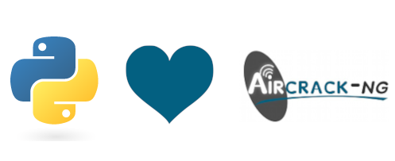

**Python aircrack-ng bindings**

PyrCrack is a Python API exposing a common aircrack-ng API. As AircrackNg will
run in background processes, and produce parseable output both in files and
stdout, the most pythonical approach are context managers, cleaning up after 

|pypi| |release| |downloads| |python_versions| |pypi_versions| |coverage| |actions|

.. |pypi| image:: https://img.shields.io/pypi/l/pyrcrack
.. |release| image:: https://img.shields.io/librariesio/release/pypi/pyrcrack
.. |downloads| image:: https://img.shields.io/pypi/dm/pyrcrack
.. |python_versions| image:: https://img.shields.io/pypi/pyversions/pyrcrack
.. |pypi_versions| image:: https://img.shields.io/pypi/v/pyrcrack
.. |coverage| image:: https://codecov.io/gh/XayOn/pyrcrack/branch/develop/graph/badge.svg
    :target: https://codecov.io/gh/XayOn/pyrcrack
.. |actions| image:: https://github.com/XayOn/pyrcrack/workflows/CI%20commit/badge.svg
    :target: https://github.com/XayOn/pyrcrack/actions

Installation
------------

This library is available on `Pypi <https://pypi.org/project/pyrcrack/>`_, you can install it directly with pip::

        pip install pyrcrack

Usage
-----

This library exports a basic aircrack-ng API aiming to keep always a small
readable codebase.

This has led to a simple library that executes each of the aircrack-ng's suite commands
and auto-detects its usage instructions. Based on that, it dinamically builds
classes inheriting that usage as docstring and a run() method that accepts
keyword parameters and arguments, and checks them BEFORE trying to run them.

Some classes expose themselves as async iterators, as airodump-ng's wich
returns access points with its associated clients.

You can have a look at the examples/ folder for some usage examples, such as
the basic "scan for targets", that will list available interfaces, let you
choose one, put it in monitor mode, and scan for targets updating results each
2 seconds.

.. code:: python

        import asyncio

        import pyrcrack

        from rich.console import Console
        from rich.prompt import Prompt

        async def scan_for_targets():
            """Scan for targets, return json."""
            console = Console()
            console.clear()
            console.show_cursor(False)
            airmon = pyrcrack.AirmonNg()

            interface = Prompt.ask(
                'Select an interface',
                choices=[a['interface'] for a in await airmon.interfaces])

            async with airmon(interface) as mon:
                async with pyrcrack.AirodumpNg() as pdump:
                    async for result in pdump(mon.monitor_interface):
                        console.clear()
                        console.print(result.table)
                        await asyncio.sleep(2)

        asyncio.run(scan_for_targets())

This snippet of code will produce the following results:

.. image:: https://raw.githubusercontent.com/XayOn/pyrcrack/master/docs/scan.png
