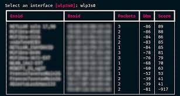

# Show me some code!


You can have also have a look at the docs_src/ folder for some usage examples,
such as the basic "scan for targets", that will list available interfaces, let
you choose one, put it in monitor mode, and scan for targets updating results
each 2 seconds.

Be sure to check the python [notebook example](./example.ipynb)


``` py

import asyncio

import pyrcrack

from rich.console import Console
from rich.prompt import Prompt

async def scan_for_targets():
    """Scan for targets, return json."""
    console = Console()
    console.clear()
    console.show_cursor(False)
    airmon = pyrcrack.AirmonNg()
    
    interface = Prompt.ask(
        'Select an interface',
        choices=[a['interface'] for a in await airmon.interfaces])
    
    async with airmon(interface) as mon:
        async with pyrcrack.AirodumpNg() as pdump:
            async for result in pdump(mon.monitor_interface):
        	console.clear()
        	console.print(result.table)
        	await asyncio.sleep(2)


asyncio.run(scan_for_targets())

```

This snippet of code will produce the following results:


